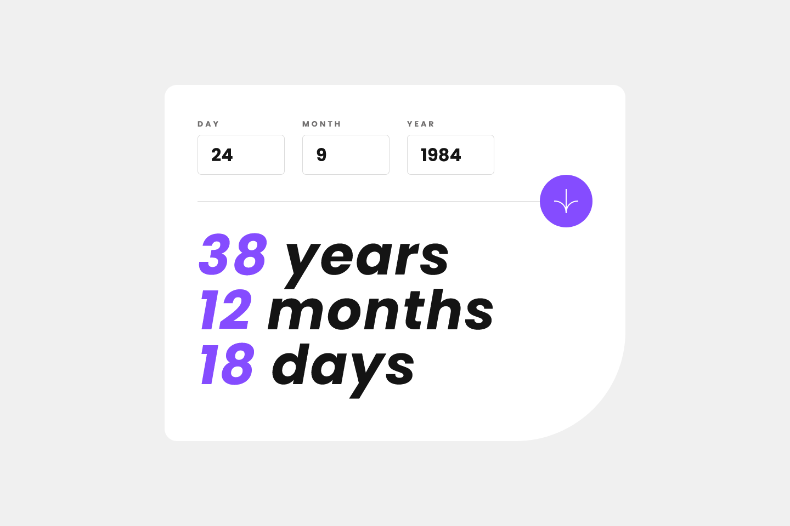

# Frontend Mentor - Age calculator app solution

This is a solution to the [Age calculator app challenge on Frontend Mentor](https://www.frontendmentor.io/challenges/age-calculator-app-dF9DFFpj-Q). Frontend Mentor challenges help you improve your coding skills by building realistic projects. 

## Table of contents

- [Overview](#overview)
  - [The challenge](#the-challenge)
  - [Screenshot](#screenshot)
  - [Links](#links)
- [My process](#my-process)
  - [Built with](#built-with)
  - [What I learned](#what-i-learned)
  - [Resources](#resources)
  - [Continued development](#continued-development)
- [Author](#author)

**Note: Delete this note and update the table of contents based on what sections you keep.**

## Overview

### The challenge

Users should be able to:

- View an age in years, months, and days after submitting a valid date through the form
- Receive validation errors if:
  - Any field is empty when the form is submitted
  - The day number is not between 1-31
  - The month number is not between 1-12
  - The year is in the future
  - The date is invalid e.g. 31/04/1991 (there are 30 days in April)
- View the optimal layout for the interface depending on their device's screen size
- See hover and focus states for all interactive elements on the page
- **Bonus**: See the age numbers animate to their final number when the form is submitted

### Screenshot

### Links

- Solution URL: [Github](https://github.com/reqayasa/fmr-age-calculator-app)
- Live Site URL: [Vercel](https://fmr-age-calculator-app.vercel.app/)

## My process

### Built with

- Semantic HTML5 markup
- Vanilla CSS and javascript
- Flexbox
- Mobile-first workflow

### What I learned

#### CSS
I made this project with vanilla CSS because i still learn it and i don't know what frontend framework i want to learn yet.

When i write the css, i ignore Mobile-first workflow because it seem not much style in mobile. But i found its actualy harder to go to mobile when desktop layout is finish so i overhaul everything and start again with Mobile-first workflow in mind. I still lack a lot of css, even i so confident. 

#### Javascript
Javascript is interesting. Maybe the javascript for this project could be simpler if it used the built in Date object. Instead of using it, I converted the date to a Julian Day Number (JDN / a sort of UNIX datetime starting from 4713 BC used by astronomers to calculate the days elapsed between two events) which I already knew. There is an algorithm to calculate JDN from a certain datetime and vice versa, link below.

In the begining i don't know why i do that, and then its usefull to check if a given date is valid that according to Gregorian and Julian Calender for every that up to 4713 BC, UNIX timestam only work until 1970. Because the function to get JDN only return value no matter what the input, the date must convert to JDN and convert back to date, if it return the same date, its valid.

Then I learned to create objects, use classes, access the DOM, perform form validation in javascript and create counter animation. It's time consuming, but fun. Most of the time learning javascript, going back and forth, writing and rewriting scripts, and splitting them up into functions

### Resources

[Astronomical Algorithms - Jean Meeus](https://www.agopax.it/Libri_astronomia/pdf/Astronomical%20Algorithms.pdf)  
[Julian Day - wikipedia](https://en.wikipedia.org/wiki/Julian_day)  
[Animated counter](https://www.geeksforgeeks.org/how-to-make-animated-counter-using-javascript/)  

### Continued development

Because I did the Julian Day Number here, so I can calculate how many days even seconds in the past up to 4713 BC, it could be interesting if I could show the days or minutes that have passed since I was born.

## Author

- Frontend Mentor - [@reqayasa](https://www.frontendmentor.io/profile/reqayasa)

